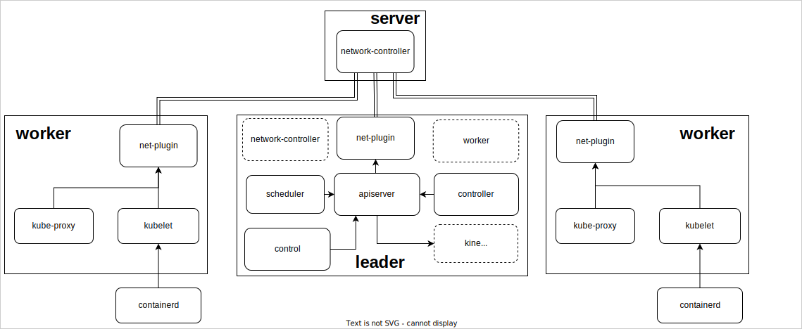

# Catalogue
- [Catalogue](#catalogue)
- [LiteKube - Portable Kubernetes](#litekube---portable-kubernetes)
- [Compatibility](#compatibility)
- [What is this?](#what-is-this)
- [Architecture](#architecture)
- [Quick Start](#quick-start)
  - [run one signal-node-cluster](#run-one-signal-node-cluster)
  - [run a cluster and disable worker for leader-node](#run-a-cluster-and-disable-worker-for-leader-node)
- [Document](#document)
- [About us](#about-us)
# LiteKube - Portable Kubernetes
One portable [kubernetes (k8s)](https://github.com/kubernetes/kubernetes) version. In test but usable, easy to install, can be run in hierarchical, dynamic network architecture. 

Great For:

- Dynamic Network
- Hierarchical Network
- IOT
- ARM
- Edge
- Raw kubernetes
- Physically moving cluster of devices

# Compatibility

| version | change |
| ------- | ------ |
| v1.24.0 | none   |

# What is this?

Litekube is a portable kubernetes version designed to run on dynamically changing or hierarchical networks , as out of the box as possible. We are close to a lot of good works, such as [Kubeadm](https://github.com/kubernetes/kubeadm) and [k3s](https://github.com/k3s-io/k3s), to try to package the application components into single binary, but avoid excessive merging to meet different needs. 

Tips:

1. At present, we have not done any function reduction for kubernetes, but we may do similar work with k3s in the future to meet the resource reduction requirement of edge devices.
2. We exposed as many entrances as possible so that people familiar how to use or maintenance native k8s could easily switch to Litekube.
3. We automatically set the parameters well, and support automatic merging and correction for most of user active input, so that anyone who wants to use native k8s can also use Litekube directly.
4. In fact, the overall memory requirements of the program are greatly reduced compared to the native k8s, and a minimal single node cluster will have less than 500MB of memory.
5. With only one publicly accessible machine, litekube can add all nodes under the network to the cluster without interrupting operations even if the network switches.

# Architecture



# Quick Start

## run one signal-node-cluster
> Read [doc](docs/leader/deploy.md) to know how to deploy.

```shell
# create ./leader.yaml:
cat >./leader.yaml <<EOF
global:
    enable-worker: true
EOF

./leader --config-file=./leader.yaml	# leader will not enable worker for default
```

​use `kubectl get csr` to check request now.

## run a cluster and disable worker for leader-node

1. run in node to deploy leader
   > No need for container runtime. Read [doc](docs/leader/deploy.md) for more detail.
 
    ```shell
    ./leader
    ```

    get worker add-in token by:

    ```shell
    ./likuadm create-token

    # assum process print as follow:
    _________________________________________________________________
    global:
        leader-token: reserverd@884d6c0e9427aa028d033996043975ad
    network-manager:
        token: 04a62af77ec44311@192.168.154.21:6439
    _________________________________________________________________
    ```
    
2. run in node to deploy worker
   > deploy `containerd` by `systemctl` is necessary. Read [doc](docs/worker/deploy.md) for more detail.
    
    ```shell
    # create ./worker.yaml:
    cat >./worker.yaml <<EOF
    global:
        leader-token: reserverd@884d6c0e9427aa028d033996043975ad
    network-manager:
        token: 04a62af77ec44311@192.168.154.21:6439
    EOF
    
    ./leader --config-file=./worker.yaml
    ```

# Document

If you want more detailed instructions, please read the [documentation](docs/Readme.md).

# About us

Litekube is still in its very early stages, so if you have any questions, please feel free to contact me by:
- yutian20@otcaix.iscas.ac.cn
- a_flying_fish@outlook.com
